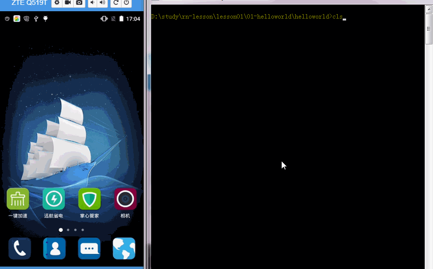

### 运行步骤

* 1、clonen 项目

```
 git clone https://github.com/ReactNative-Lover/rn-lesson.git
```

* 2、进入到项目目录并安装依赖

```
cd lesson01/01-helloworld/helloworld
yarn install
```

* 3、运行项目

```
react-native run-android
```

> 查看结果：


