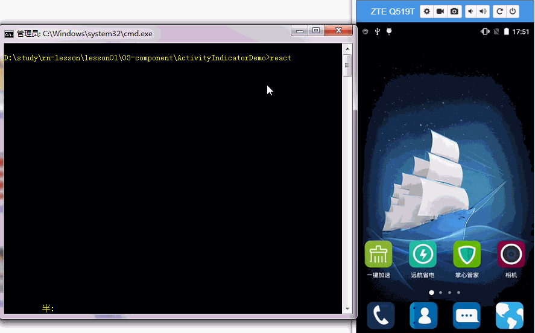

> demo 运行

* 1、clone 项目

```
 git clone https://github.com/ReactNative-Lover/rn-lesson.git
```

* 2、进入到项目目录并安装依赖

```
cd lesson01/03-component/ActivityIndicatorDemo
yarn install
```

* 3、运行并查看结果

```
react-native run-android
```


