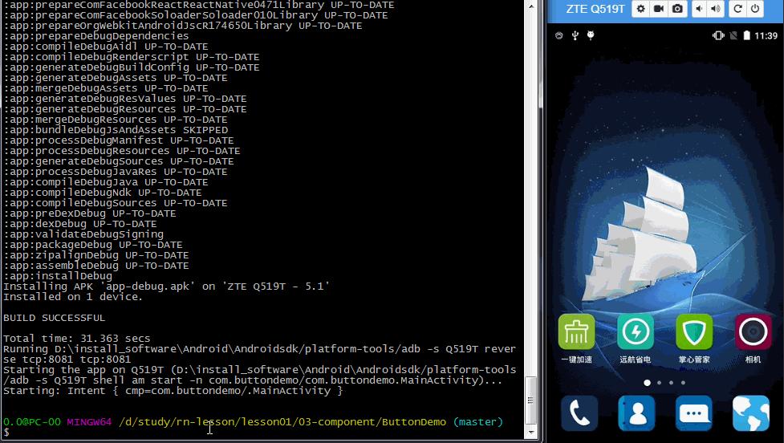

### 一、对于 RN 中的 Button 来说，有两种试来创建者

* 1、使用系统的 Button
* 2、如果想要丰富的 Button 可以使用 TouchableOpacity TouchableNativeFeedback 和 TouchableHighlight 来自定义自己的 Button

### 二、各个 Button 的使用方式

* 1、对于系统的 Btton

```
<Button
  onPress={onPressLearnMore}
  title="Learn More"
  color="#841584"
  accessibilityLabel="Learn more about this purple button"
/>
```

* 2、TouchableOpacity

```
<TouchableOpacity onPress={this._onPressButton}>
    <View><View>
</TouchableOpacity>
```

其中 View  可以是 Text ， Image 等 View

* 3、TouchableHighlight

```
<TouchableHighlight
  style={{backgroundColor:'orange',margin:5}}
  activeOpacity={0.5}
  //点下去的颜色
  underlayColor='#ffeecc'
  onPress={() =>{
    alert('click me')
  }}>
  <View style={...}>
    ... 里面可以再嵌套
  </View>
</TouchableHighlight>
```


### 3、本 Demo 的运行步骤

* 1、coloe 项目

```
 git clone https://github.com/ReactNative-Lover/rn-lesson.git
```

* 2、进入到项目目录，安装依赖

```
cd lesson01/lesson01/03-component/ButtonDemo
yarn install
```

* 3、运行 demo 查看结果

```
react-native run-android 或者 react-native run-ios
```


