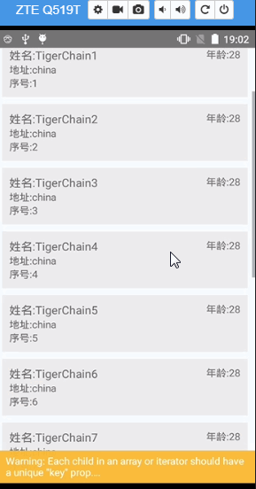

### 一、FlatList
FlatList 是高性能的简单列表组件，是 ListView ,它有以一特性

* 完全跨平台。
* 支持水平布局模式。
* 行组件显示或隐藏时可配置回调事件。
* 支持单独的头部组件。
* 支持单独的尾部组件。
* 支持自定义行间分隔线。
* 支持下拉刷新。
* 支持上拉加载。
* 支持跳转到指定行（ScrollToIndex）。

### 二、使用方法

```
<FlatList
  // 数据源
  data={this.state.data}
  // 渲染每条数据
  renderItem={this._renderItem}
  keyExtractor={this._keyExtractor}
  // 添加头部
  ListHeaderComponent={this._renderHeader}
  //添加尾部
  ListFooterComponent={this._renderFooter}
  //下拉刷新
  refreshControl={
       <RefreshControl
         refreshing={false}
     />
  }
 getItemLayout={(data, index) => ( {length: 80, offset: 80 * index, index} )}
onEndReachedThreshold={0.5}
// 实现上拉加载更多
onEndReached= {(info) =>{
  // alert('到达底部了')
  datas.push({name:'新数据',age:28,address:'china'})
}}
/>
```

### 三、运行 Demo

* 1、clone 项目

```
 git clone https://github.com/ReactNative-Lover/rn-lesson.git
```

* 2、进入到项目目录，安装依赖

```
cd lesson01/03-component/FlatListDemo
yarn install
```

* 3、运行查看结果

```
react-native run-android 或 react-native run-ios
```


