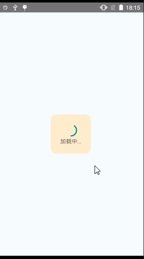

### 一、SectionList 高性能的分组列表,有以下特性

* 完全跨平台。
* 支持水平布局模式。
* 行组件显示或隐藏时可配置回调事件。
* 支持单独的头部组件。
* 支持单独的尾部组件。
* 支持自定义行间分隔线。
* 支持下拉刷新。
* 支持上拉加载。


### 二、 使用方法

```
<SectionList
  // 数据源
  sections={this.state.datas}
  // 渲染子项目
  renderItem={this._renderItem}
  // 渲染分组组件
  renderSectionHeader={(info) =>{
    return <Text style={{height:30,textAlignVertical:'center',backgroundColor:'orange',fontSize:16,paddingLeft:7}} onPress={()=>{alert(info.section.key)}}>{info.section.key}</Text>
  }}
  // 不加会报缺少 key 的警告
  keyExtractor={(item, index) => index}
  //添加分隔线
  ItemSeparatorComponent={()=>{
    return <Text style={{height:1,backgroundColor:'#e3e3e3'}}></Text>
  }}
  >
  //还可以添加下拉刷新 ，头组件、属组件等等
</SectionList>
```

### 三、运行 demo

* 1、clone Demo

```
 git clone https://github.com/ReactNative-Lover/rn-lesson.git
```

* 2、进入到 demo 目录并安装依赖

```
cd lesson01/03-component/SectionListDemo
yarn install
```

* 运行查看结果

```
react-native run-android 或 react-native run-ios
```


