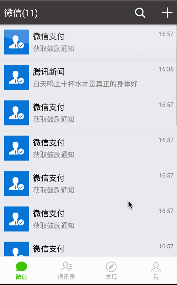
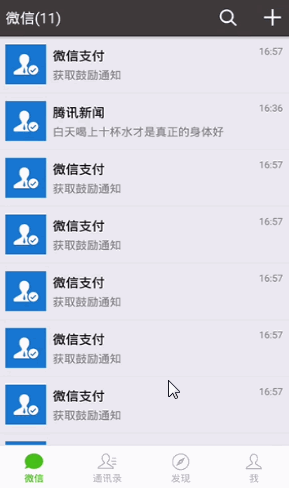

### 一、这是一个仿微信的 RN demo 慢慢完善

### 二、应用截图，后面补充

### 三、运行 demo

* 1、clone Demo

```
 git clone https://github.com/ReactNative-Lover/rn-lesson.git
```

* 2、进入到 demo 目录并安装依赖

```
cd lesson02/01-wxdemo/wxchat
yarn install
```

* 运行查看结果

```
react-native run-android 或 react-native run-ios
```




* 完成朋友圈，+ 号弹窗和二维码功能


